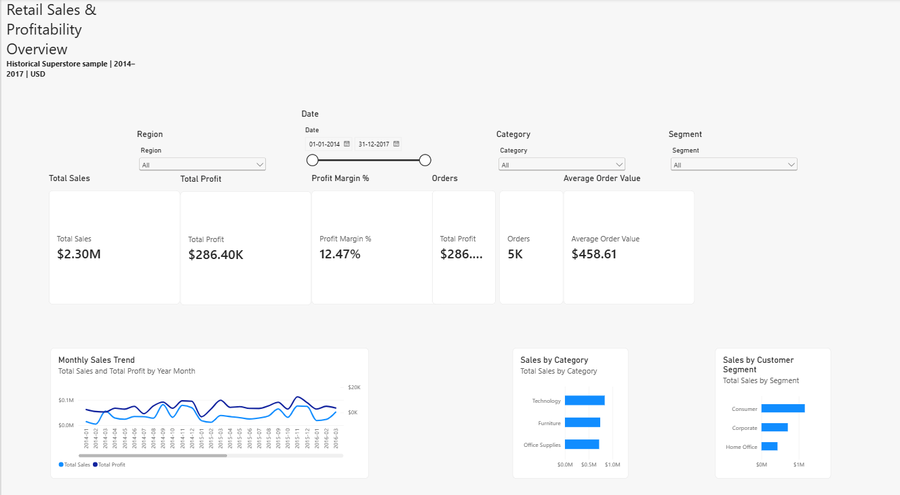
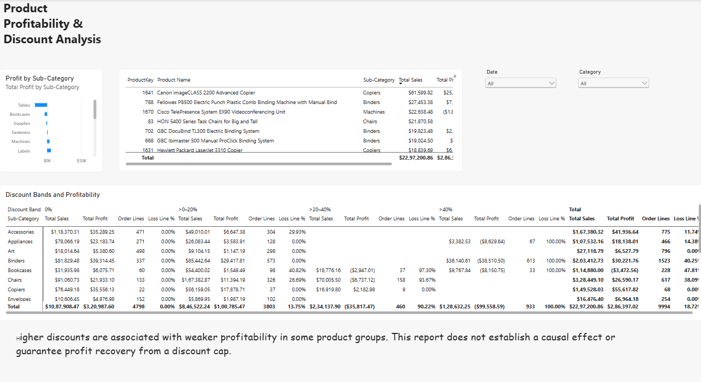
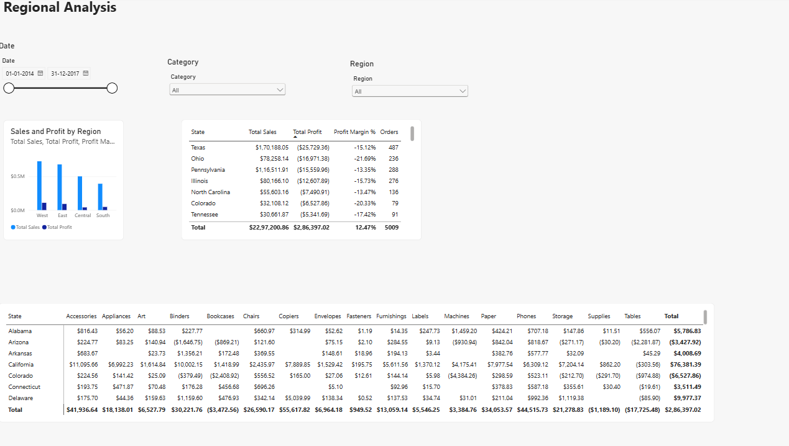
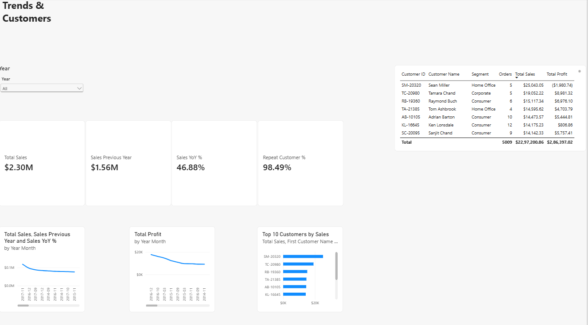

# Retail Sales & Profitability Analysis

An end-to-end data analytics project using Python, SQL, and Power BI to explore retail sales, profitability, customer behavior, and regional performance.

## Project Overview

This project analyzes the Sample Superstore dataset to identify profitable business areas, investigate losses, and support business recommendations.

The analysis covers **9,994 order lines**, **5,009 orders**, and **793 customers** across **2014–2017**.

## Tools & Technologies

- Python — Pandas, NumPy, Matplotlib
- SQL — SQLite
- Jupyter Notebook
- Power BI — Power Query, data modeling, DAX

## Project Structure

```text
sales_analysis_starter/
├── data/
│   ├── raw/
│   └── processed/
├── notebooks/
├── src/
├── sql/
├── powerbi/
│   ├── data/
│   ├── sales_analysis.pbix
│   ├── measures.dax
│   └── BUILD_GUIDE.md
├── reports/
│   ├── figures/
│   └── tables/
├── DATA_DICTIONARY.md
├── requirements.txt
├── run_all.py
└── README.md
```

## Workflow

1. Profiled and validated the source data using Python.
2. Analyzed sales, profit, discounts, customers, and time trends.
3. Built SQL queries and reconciled key results with Pandas.
4. Exported fact and dimension tables for Power BI.
5. Created DAX measures and a four-page interactive report.
6. Developed findings and recommendations with documented assumptions.

## Dashboard Pages

### 1. Executive Overview

- Total sales, profit, margin, orders, and average order value
- Monthly sales trends
- Category and customer-segment performance
- Interactive date, region, category, and segment filters



### 2. Product Profitability

- Sub-category profit comparison
- Product-level sales and margins
- Discount-band analysis
- Identification of loss-making product groups



### 3. Regional Analysis

- Regional sales and profit comparisons
- State-level profitability
- State and sub-category profit matrix



### 4. Trends & Customers

- Monthly sales and profit trends
- Previous-year sales and year-over-year growth
- Repeat customer percentage
- Top 10 customers by sales



## Key Results

| Metric | Value |
|---|---:|
| Total Sales | $2,297,200.86 |
| Total Profit | $286,397.02 |
| Profit Margin | 12.47% |
| Orders | 5,009 |
| Customers | 793 |

## Key Insights

- **Technology** generated the highest category sales at **$836,154.03**.
- **Tables** and **Bookcases** recorded losses of **$17,725.48** and **$3,472.56**, respectively.
- **Texas** was the lowest-profit state, recording a loss of **$25,729.36**.
- Higher discounts were associated with weaker profitability in some product groups, although individual transaction outcomes varied.
- Customer concentration and repeat purchasing were analyzed to support customer prioritization.

## Recommendations

1. Review discount policies and transaction economics for loss-making furniture products.
2. Investigate product and discount mix in low-profit states.
3. Evaluate products using both revenue and profitability before allocating resources.
4. Use historical monthly patterns to inform planning, supported by recent demand data.
5. Test pricing changes before wider implementation.

## How to Run

### Python Analysis

Install the dependencies:

```bash
pip install -r requirements.txt
```

Open JupyterLab:

```bash
jupyter lab
```

Run the notebooks in order, from `01_data_quality.ipynb` through `06_powerbi_exports.ipynb`.

### Power BI Report

Open the following file in Power BI Desktop:

```text
powerbi/sales_analysis.pbix
```

If refreshing on another computer, update the CSV source paths to the local `powerbi/data/` folder.

## Dataset & Limitations

**Dataset:** Sample Superstore — historical US retail sample data.

Discount relationships are observational, and pricing scenarios depend on assumptions. Findings do not represent guaranteed business outcomes. Returns, inventory levels, and delivery dates are not available in the dataset.